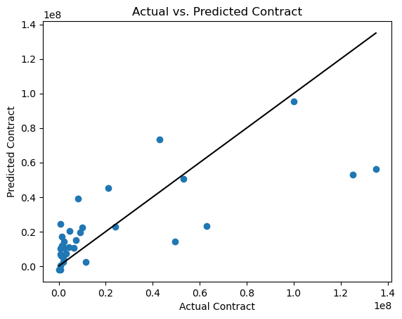
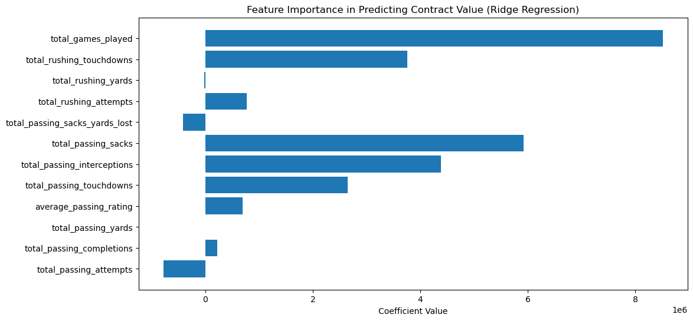
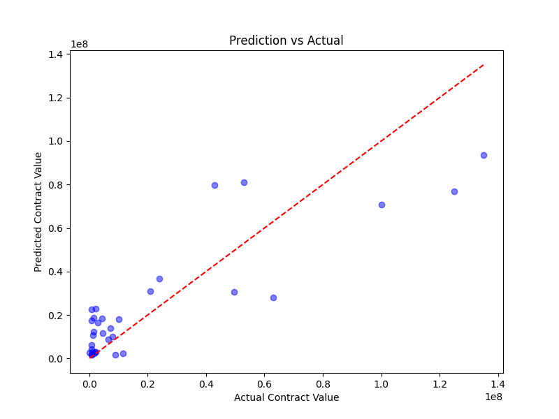
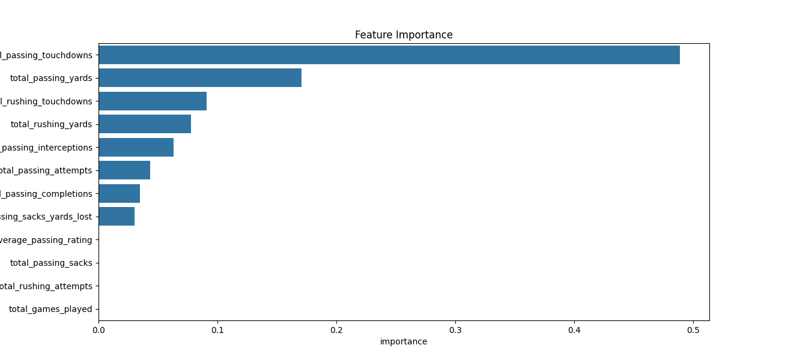
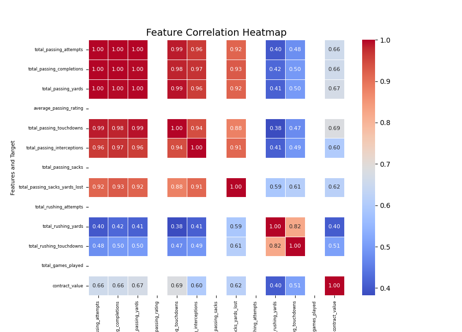
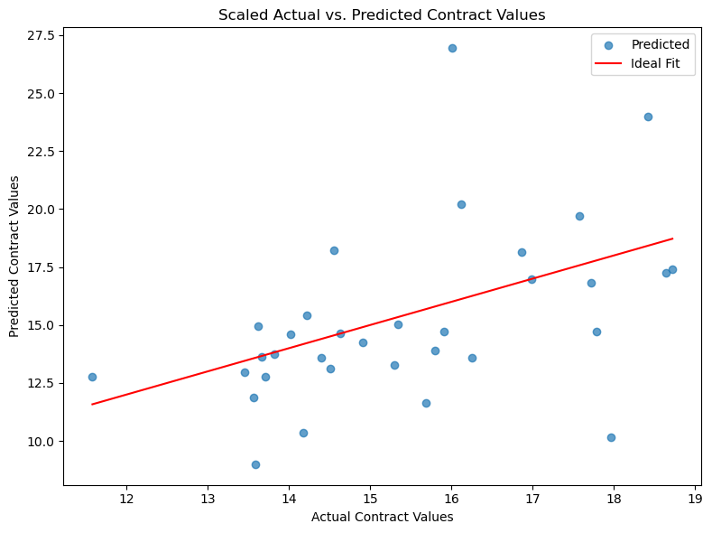
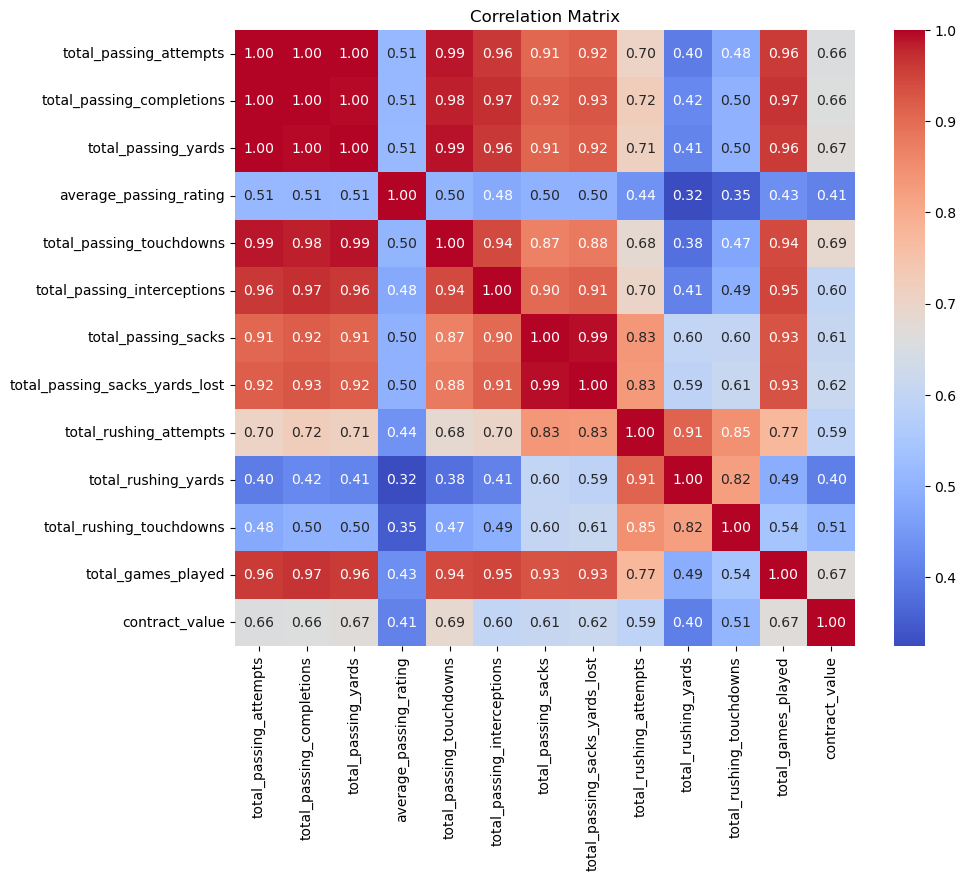
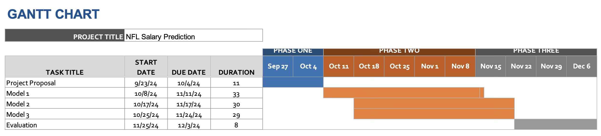

# NFL Salary Prediction | Final Checkpoint

## Introduction

Over the past decade, a phenomenon that has plagued NFL front offices is the growing movement supporting the players' leverage over general managers during contract negotiations. With the rise of “holding out”, where players do not participate in training camp or games until a better contract is agreed on, teams find themselves under pressure to grant unaffordable contracts just to keep a player rostered [1]. With Machine Learning, there could be a stat-based way to suggest fair, mutually beneficial contracts for both sides of the deal. 
To complete this, our group has chosen to use the two datasets linked below, one for historical contracts for various players and one for all NFL individual stats by season to derive a model to predict a new contract for upcoming players due for extensions. We hope to consider baseline stats as well as positional value when completing this project. 

### Dataset 1
> https://www.kaggle.com/datasets/zynicide/nfl-football-player-stats/data
> This dataset goes through individual NFL player stats by season for every player going back to the 1940’s. This will have all of the player data that we need to make performance based predictions. 

### Dataset 2
> https://www.kaggle.com/datasets/nicholasliusontag/nfl-contract-and-draft-data/data
> This dataset has all of the contract data going from the 2000’s (which we already have contract data for). This will allow us to add the contract details for each year on an individual player’s stats.

## Problem Definition
In order to help solve contract disputes and improve the negotiation process, we aim to use machine learning to create an algorithm that can accurately predict what a player’s new contract value should be based on their position, performance during previous seasons, and the current market. Current work in sports analytics focuses on game outcomes [2] and player performance [3] instead of monetary outcomes, and this research can help level the playing field for players.

## ML Methods

We will use three supervised machine learning methods for this project.

| Type         | Description       
|:-------------|:------------------|
| Ridge Regression | This will be our most interpretable model. It will be helpful for comparing relationships between player stats (passing touchdowns, rushing yards, interceptions, etc.) and salary with some optimizations to prevent overfitting.
| Random Forest | Random forest is our middle ground method, and will be helpful for modeling non-linear relationships. It is still somewhat interpretable, but can find more complex relationships Linear Regression may miss.  
| Neural Networks | This model will be the best for complex patterns, and has potentially the highest accuracy. However, it is the least interpretable model.

## Preprocessing Implementations

To produce the data for these models, we had to do a lot of data cleaning and preprocessing to make our dataset workable. 

We started with the two datasets, the player stats and the contract stats. We scan through each player name we have contracts for, and find the corresponding stats for the player in the gamestats database. In order to associate game years with contract years, we developed an algorithm to calculate the game year ranges for each contract. For our initial state, we also are filtering by QB, and ignore any data points that are missing corresponding stats and are zeroed out.

**Data Transformation**: Using the data from both the contracts dataset and player stats dataset we aligned both by player name to track the stats of each player during their corresponding contract year.

**Data Cleaning**: We're filtering out all data for players that are not quarterbacks, and who have zero stats available.

**Feature Engineering**: Using the contract years for each player from the contracts dataset, we calculate the time ranges the player was playing between each contract. After this, we aggregate all of the players stats and match it to each contract year time period.

## Implemented Solution #1: Ridge Regression 

For our first solution, we intended to implement linear regression to predict contract values for the QB position. We chose to implement this model first for its simplicity, interpretability, and lower variance. This method allowed us to do some data exploration and see what our model was using the most to complete the prediction. Through our exploration, we noticed that our features were highly correlated. This is inherently true with football statistics as things like passing yards and passing touchdowns will be correlated. 

To alter this, we decided to use ridge regression because it adds an L2 penalty to reduce the correlation between features. This regulization technique made our model more stable, provided valuable information about how important certain features are, and helped reduce overfitting.

## Implemented Solution #2: Random Forest

The second model that we used for this project was Random Forest, which served as our middle-ground model. NFL contract value predictions have complex interactions between various features (passing yards, rushing yards, etc.), and random forest can capture these non-linear relationships without explicit feature engineering. Using Random Forest we were able to make predictions of contract values by combining the results of multiple decision trees. This was especially helpful since it was able to identify the complex relationships between the correlated features in the dataset. Moreover, NFL contracts vary widely, with a large discrepancy between great players and average players, and random forest is less sensitive to imbalances between data. It does well with skewed data. Lastly, hyperparameter tuning for random forest allowed us to properly optimize performance for specific datasets.

## Implemented Solution #3: Neural Network
The third model that we implemented for this project was a neural network. This method takes into account the relationships between the complex features and non-linear patterns in the dataset. The neural network included an input layer to analyze features such as passing yards, passing touchdowns, interceptions, etc. It also had a hidden layer to evaluate the patterns within the features, and it included an output layer that predicted the contract value. Additionally, the model implemented early stopping to consider validation loss and reduce overfitting. The points were then scaled by using a logarithmic function to normalize the features and handle skewed data. All of these techniques were combined to provide a good prediction of contract values and identify what features were the most correlated.

## Results #1: Ridge Regression

After performing the Ridge Regression as our first model, we found that our dataset had highly correlated features. For example, if a QB has high number of passing yards, it can inferred that they would also have a high number of passing attempts, passing completions, passing touchdowns, and more. This may have contributed to a lower $r^2$ value than we anticipated as our model struggled to shrink coefficients. We also had to account for irrelavant features by adding weights to have the model consider them less. Our $r^2$ at the end was .547, which is a step in the right direction in predicting the accurate contract values. Similarly, the RMSE value was $23M, which may seem high, but given that the some contracts go up to $100-200M, the RMSE isn't the worst value. The team's goal is to significantly improve the RMSE and $r^2$ moving forward. There were also non-statistical factors that cannot be taken into acount, such as experience, endorsements, and injury history, that were difficult to take into account for contract negotiations.

In order to decrease the RMSE and $r^2$, we plan on taking a different approach to the models, including using tree-based models and neural networks. The non-linear models (e.g random forest) could capture the complexity of salaries better.

The Actual VS Predicted Contract visualization shows that there is a lot of variance in our prediction accuracy, as some datapoints are very scattered while others form clusters around the extreme contract values. This could be because some of the features in our graph are being weighted more heavily than others, although most of them are correlated.

The coefficient visualization displays how important each feature was in our model's prediction. It showcases how increases in total games played and touchdowns scored are associated with more valuable contracts. These features are dominating the predictions, so implementing weights on other stats such as passing yards, rushing yards, and interceptions thrown can help make our predictions more accurate.

## Results #2: Random Forest
After implementing random forest, we achieved promising results of an $r^2$ value of .7301 on the test set. The best hyperparameters for the model were {'max_depth': 5, 'min_samples_leaf': 3, 'min_samples_split': 2, 'n_estimators': 83}, which allowed us to balance bias and variance effectively. The feature importance analysis highlights that total passing touchdowns and total passing yards are the most influential predctors, which aligns with our expectations that quarterback performance aligns heavily with contract value. Interestingly, features like rushing yards and rushing touchdowns also impacted prediction value, which indicates that a quarterback being dual-threat may be favorable in contract negotiations. The random forest model also highlighted that several features like passer rating and passing sacks had a very little impact on contract value. Despite a high $r^2$, the RMSE of \$18.49M tells us that there is room for improvement within the model, but it is lower than the ridge regression. Again, considering that NFL contracts can exceed \$200M at times, it is reasonable. While our test set had $r^2$ value of .7301, the training $r^2$ value was .8119. This means there was slight overfitting, but this could be addressed through regularization and introduction of addtional data.

This graph looks very similar to the ridge regression model because these two capture the same trends. Random forest, however, is particulary better at predicting extreme or nuanced cases where as the ridge regression may underestimate/overestimate those areas, leading to a lower $r^2$.

The feature importance visualization shows the shear impact that passing touchdowns and passing yards had on the contract value. This suggests that scoring and passing are the most important attributes sought after in quarterbacks and is reflected in their contracts. While rushing yards and touchdowns are important, they contribute less to the predictions. By fine-tuning the weights for these features, we could refine our model even more for better contract value predictions.

This correlation matrix shows the relationships between the dataset features and contract_value. The values range from -1 to 1, which show negative to positive correlation. Passing-related features area highly correlated (showing multicollinearity) while rushing stats have weaker correlations, which are indicated by the blue color.

## Results #3: Neural Network
After running our neural network model, we were presented with some valuable results. The use of early stopping, feature scaling, dropout layers helped to improve the quantitative values used to analyze our model. The MAE value for this model was $2.27 million which indicates that our contract predictions were only off by a few million dollars on average. Considering the fact that NFL contracts can end up as high as $450 million, this margin of error is relatively good. Additionally, we found our RMSE value for the neural network model to be $3.27 million. Comparing this value to our MAE value shows that outliers (such as players that only played a few snaps) negatively impacted the performance of our model. The RMSE is still relatively low, which is a good indicator of our model working well.

Although there were a few outliers, the graph above shows that the predicted contract values were relatively close to the actual values recorded. The neural network had less variance than other models due to its feature learning and data scaling methods. Therefore, many of the datapoints were around the line of best fit.

The correlation matrix displays important information about our features, indicating how they are connected to each other. This is especially helpful since neural networks don’t show explicit coefficients that we can use to analyze feature importance. This matrix shows that some stats such as rushing yards, rushing touchdowns, and passer rating had weak relationships with the other features, while pass attempts, pass completions, pass touchdowns, and passing yards were all heavily related to each other. These results are important for understanding how certain combinations of features impacted the model performance 

## Model Comparisons

Ridge Regression had the highest RMSE at $23M and lowest R^2 with a value of .0.547. It was the overall worst performing option. The data was highly correlated, but the relationships were not linear.

Random Forest had the highest R^2, with a value of 0.7301. Overall, Random Forest performed well, especially with handling complex patterns. But it showed slight signs of overfitting.

The Neural Network had by far the lowest RMSE at $3.27 million. This is compared to Ridge Regression at $23 million and Random Forest at $18.49 million. Neural Networks overall handled the relationships in the data the best.

* * *

## Gantt Timeline

## Contribution Table

| Person         | Contribution       
|:-------------|:------------------|
| Tai'Re | Neural Network Model Implementation, Data Preprocessing, Data Visualization
| Daksh | Random Forest Model Implementation, Model Selection, Gantt, Results
| Neil | Ridge Regression Model Implementation, Model Selection, Model Implementation
| Rohan | Data Preprocessing, Model Implementation
| Max | Data Preprocessing, Results, Presentation

## Next Steps

To refine model performance, conducting more extensive grid or random search can optimize hyperparameters effectively, ensuring the model reaches its full potential. Feature engineering plays a pivotal role in addressing multicollinearity, where techniques like Principal Component Analysis (PCA) or targeted feature selection can simplify the feature space while retaining critical information. For advanced modeling, implementing architectures such as Long Short-Term Memory Networks (LSTMs) or Transformers can capture sequential interactions and dependencies, offering robust solutions for tasks involving time-series or textual data. Finally, thorough error analysis can reveal systematic patterns or specific cases where the model underperforms, enabling targeted adjustments to enhance overall accuracy and reliability.

## References

[1] J. Sallow, "Holdouts, Lockouts, and Payouts: The National Football League's Bargaining Power Phenomenon," Law & Psychology Review, vol. 43, pp. 239–261, 2019.

[2] M. Gifford and T. Bayrak, "A predictive analytics model for forecasting outcomes in the National Football League games using decision tree and logistic regression," Decision Analytics Journal, vol. 8, p. 100296, 2023.

[3] F. E. Kuzmits and A. J. Adams, "The NFL combine: does it predict performance in the National Football League?," Journal of Strength and Conditioning Research, vol. 22, no. 6, pp. 1721-1727, 2008.

